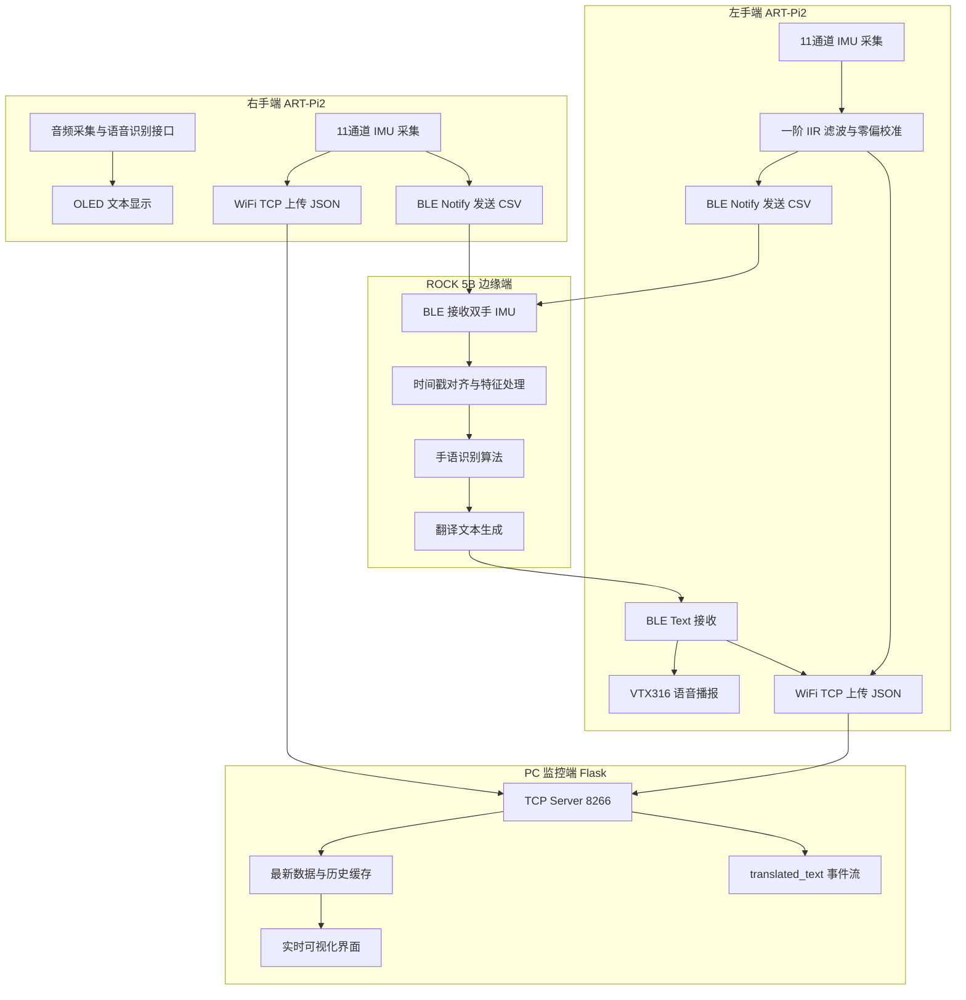
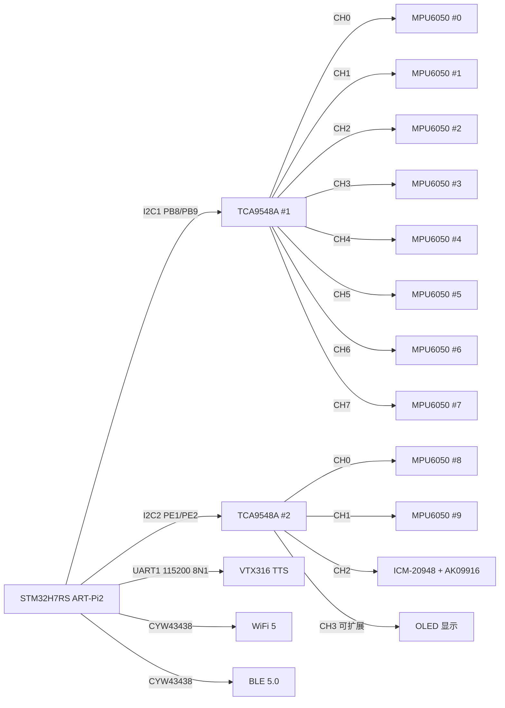
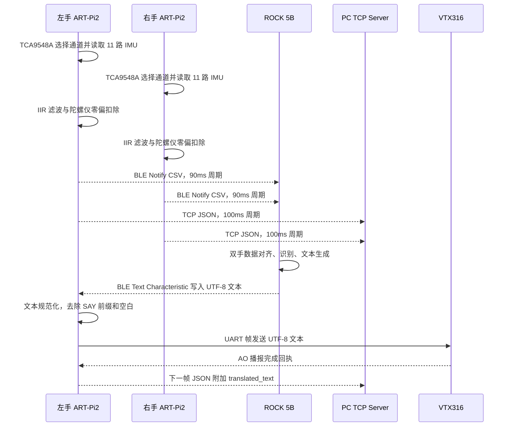
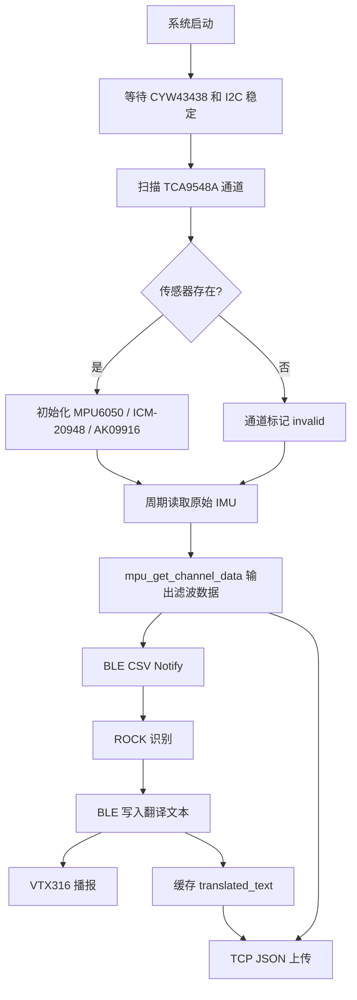

# 基于 ART-Pi2 的双手实时手语翻译系统技术文档

## 第一章 作品概述

### 1.1 作品名称

本作品名称为“基于 ART-Pi2 的双手实时手语翻译系统”。系统以 ART-Pi2 开发板为左右手可穿戴端主控平台，结合多通道惯性传感、低功耗蓝牙通信、WiFi TCP 数据上传、边缘计算识别、语音合成播报和 PC 端实时监控，实现面向听障人士与普通交流对象的手语辅助翻译。

### 1.2 应用领域

本作品面向无障碍通信、智能辅助设备和物联网应用领域。其核心目标是把手语动作转换为普通用户易理解的文字和语音，同时为反向沟通提供语音识别、文本显示和系统状态反馈能力，使听障人士在家庭、校园、公共服务窗口、医疗咨询和日常办事等场景中获得更直接的沟通支持。

### 1.3 主要功能

系统由左手端、右手端、ROCK 5B 边缘计算端和 PC 监控端组成。左右手端分别完成 11 通道 IMU 数据采集，其中 ch0 至 ch9 为 10 个 MPU6050 六轴传感器，ch10 为 1 个 ICM-20948 九轴传感器，双手合计 22 个空间运动采集通道。固件在 RT-Thread 上运行，通过 TCA9548A 扩展 I2C 总线，实现多传感器分时访问；通过一阶 IIR 低通滤波和陀螺仪零偏校准降低动作数据抖动；通过 BLE Notify 将 CSV 格式 IMU 数据发送至 ROCK 5B；通过 TCP JSON 帧上传 IMU、电池和翻译文本到 PC 端 Flask 监控界面。ROCK 5B 负责融合双手数据并执行手语识别算法，识别出的文字可回传至左手端，由 VTX316 语音模块播报。右手端保留音频采集、语音识别和 OLED 显示接口，用于语音到手语辅助提示方向的双向翻译扩展。

### 1.4 创新性说明

本作品的设计思路创新性体现在“双手协同采集 + 边缘计算”的系统架构。常见手语翻译原型多集中在单手手套或摄像头识别，本系统针对真实手语中双手协同、手背朝向、腕部姿态和指节动作同时存在的特点，采用左右手分布式采集、边缘端统一识别的方案，降低单端计算压力，并提高对双手动作的表达能力。

技术创新性体现在实时数字滤波和通信链路优化。固件在 `mpu_get_channel_data()` 数据出口统一执行指数移动平均滤波，MPU6050 使用 `alpha=0.25`，ICM-20948 使用 `alpha=0.10`，并在校准完成后自动扣除陀螺仪零偏。BLE 侧使用 NimBLE 协议栈，连接后主动请求 MTU 交换，使默认 23 字节链路提升到 247 字节级别，以适配完整 CSV 帧；Notify 线程采用 512 字节缓冲区并加入溢出检查，提升帧完整性。

硬件创新性体现在 22 通道 IMU 分布式采集和双 TCA9548A I2C 复用结构。每只手使用 10 个六轴 IMU 捕捉手指局部动作，使用 1 个九轴 IMU 捕捉手背整体姿态和磁场方向，兼顾细粒度和整体姿态信息。应用创新性体现在双向翻译与低延迟闭环：手语到语音方向完成“IMU 采集、BLE 上传、边缘识别、文本回传、VTX316 播报”；语音到手语方向通过音频识别和 OLED 文本显示提供交互入口。系统兼具可穿戴性、可监控性和可扩展性，适合竞赛展示与后续产品化迭代。

## 第二章 需求分析

### 2.1 开发背景与动机

听障人士在日常交流中常面临手语使用者与非手语使用者之间的信息不对称。传统解决方式依赖人工翻译、文字输入或手机语音转文字，难以覆盖双手动态手势、实时互动和公共服务即时沟通等需求。现有手语翻译设备主要包括传感器手套、摄像头视觉识别和单手 IMU 原型。传感器手套可穿戴但多为单手、通道少且价格高；视觉识别方案对光照、遮挡、拍摄角度和固定设备依赖较强；单手 IMU 原型便携性较好，但难以描述双手手语动作。本作品以开源硬件为基础，构建双手 22 通道 IMU 采集、边缘计算识别、语音播报和 PC 可视化监控闭环，在成本、便携性和实时性之间取得平衡。

### 2.2 竞品分析

| 对比维度 | 本作品（ART-Pi2） | 竞品 A（手语翻译手套） | 竞品 B（视觉识别方案） | 竞品 C（单手传感器） |
|---------|------------------|---------------------|---------------------|------------------|
| 采集方式 | 双手 IMU，22 通道 | 单手弯曲传感器或少量 IMU | 摄像头、深度相机或 Leap Motion | 单手 IMU |
| 采集通道数 | 22 通道 IMU | 5-10 通道，常见为每指 1 个弯曲量 | 不适用，依赖图像关键点 | 6 通道或 9 通道 |
| 实时性 | 设计端到端 < 500ms，BLE 上报约 90ms | 约 1s，取决于蓝牙和算法 | 约 1-2s，受图像推理影响 | 约 800ms |
| 双向翻译 | 支持，手语到语音、语音到文本显示 | 通常不支持 | 通常不支持 | 通常不支持 |
| 识别准确率 | 待测试 | 公开原型常见 70%-80%，词表受限 | 理想光照下约 85%-90%，遮挡下降明显 | 常见 60%-70%，双手动作不足 |
| 成本 | 目标低于 1000 元，基于开源硬件和市售模块 | 约 3000-5000 元 | 约 5000-10000 元，含相机和计算平台 | 约 1500-2000 元 |
| 便携性 | 五星，可穿戴，左右手分布式 | 四星，可穿戴但手套束缚明显 | 二星，通常依赖固定相机 | 四星，可穿戴 |
| 环境要求 | 无固定光照要求 | 无固定光照要求 | 需良好光照和无遮挡视野 | 无固定光照要求 |
| 数据滤波 | 实时 IIR 滤波和零偏校准 | 多数商业方案未公开 | 图像算法内置平滑，不适用 IMU | 多数原型未公开 |
| 开源性 | 使用开源硬件和自定义协议，便于复现 | 多为商业闭源 | 多为商业闭源或平台绑定 | 多为科研原型 |
| 扩展性 | 高，可扩展 BLE/TCP、词库和算法 | 中，受传感器布局限制 | 中低，受场景和相机视野限制 | 中，受单手信息量限制 |

表中竞品数据用于竞赛方案对标，来源为公开原型和同类系统常见指标区间，具体数值会随产品型号、词库规模和测试集变化。本作品已从代码确认采集通道、BLE 周期、滤波参数和 TCP 数据结构；识别准确率、完整端到端时延、功耗和长时间稳定性仍需在统一测试集上补充。

### 2.3 目标用户

目标用户包括听障人士、手语学习者和无障碍服务提供方。听障人士可通过系统把常用手语动作转化为语音，减少与非手语使用者沟通时的中断；手语学习者可借助 IMU 数据和 PC 监控界面观察动作差异；政府服务窗口、医院、银行、学校和社区服务中心可把系统作为无障碍辅助终端。

### 2.4 主要功能

系统主要功能包括双手 IMU 数据采集、手语动作识别与翻译、语音合成播报、语音到文字显示、TCP 数据上传和 PC 实时监控。左手端重点承担 IMU 上报和 VTX316 播报，右手端重点承担 IMU 上报、音频采集和 OLED 显示，边缘端负责识别算法，PC 端负责数据接收、历史缓存、状态展示和调试。

### 2.5 主要性能指标

| 性能项 | 指标 |
|-------|------|
| 单手 IMU 通道 | 11 通道，10 个 MPU6050 + 1 个 ICM-20948 |
| 双手 IMU 通道 | 22 通道 |
| IMU 采集周期 | 固件当前输出周期 90ms；传感器目标采样能力按 100Hz 设计 |
| BLE Notify 频率 | 90ms，约 11.1Hz |
| TCP 上传频率 | 100ms，约 10Hz |
| BLE MTU | 连接后主动请求交换，已按 247 字节级别验证 |
| 滤波延迟 | 设计 < 10ms |
| 端到端延迟 | 设计 < 500ms，完整链路待测试 |
| 识别准确率 | 待测试 |

## 第三章 技术方案

### 3.1 硬件组成与来源

左手端以 ART-Pi2 为主控，连接 11 个 IMU 传感器、2 个 TCA9548A I2C 复用器和 1 个 VTX316 语音合成模块，主要负责左手动作采集、BLE 上报、WiFi TCP 上传和翻译文本播报。

| 硬件名称 | 型号 | 数量 | 来源 | 功能 |
|---------|------|------|------|------|
| 主控板 | ART-Pi2（STM32H7RS） | 1 | RT-Thread 开源硬件 | 主控、RTOS、WiFi、BLE |
| 6 轴 IMU | MPU6050 | 10 | 市售 | 加速度和陀螺仪采集 |
| 9 轴 IMU | ICM-20948 | 1 | 市售 | 加速度、陀螺仪和磁力计采集 |
| I2C 复用器 | TCA9548A | 2 | 市售 | 扩展 I2C 设备数量 |
| 语音模块 | VTX316 | 1 | 市售 | TTS 语音播报 |

右手端硬件结构与左手端保持一致，并增加 OLED 显示和音频采集相关接口，用于显示识别结果、系统连接状态和电池信息。

| 硬件名称 | 型号 | 数量 | 来源 | 功能 |
|---------|------|------|------|------|
| 主控板 | ART-Pi2（STM32H7RS） | 1 | RT-Thread 开源硬件 | 主控、RTOS、WiFi、BLE |
| 6 轴 IMU | MPU6050 | 10 | 市售 | 加速度和陀螺仪采集 |
| 9 轴 IMU | ICM-20948 | 1 | 市售 | 加速度、陀螺仪和磁力计采集 |
| I2C 复用器 | TCA9548A | 2 | 市售 | 扩展 I2C 设备数量 |
| OLED 显示 | 128×64 | 1 | 市售 | 文本和状态显示 |

边缘计算端采用 ROCK 5B，搭载 RK3588 处理器，负责 BLE 接收、双手数据融合、手语识别和翻译文本生成。PC 监控端运行 Python Flask 服务和 TCP 服务，默认 TCP 监听端口为 8266，支持多客户端接入、最新数据缓存、历史数据缓存和可视化展示。

### 3.2 系统设计图

系统架构图如下。



硬件连接框图如下。



通信时序图如下。



软件流程图如下。



### 3.3 功能描述

左手端功能模块包括 IMU 数据采集模块、BLE 通信模块、VTX316 播报模块和 TCP 通信模块。IMU 模块通过两个 TCA9548A 管理 I2C1 与 I2C2 上的 11 个传感器，采集到的数据保存在 `mpu_data_i2c1[]` 和 `mpu_data_i2c2[]` 中；对外调用 `mpu_get_channel_data()` 时统一进行滤波和零偏扣除。BLE 模块由 `imu_ble_service.c` 定义 GATT 服务，由 `imu_notify_thread.c` 周期构造 CSV 帧并 Notify 至订阅端。VTX316 模块通过 UART1 发送合成语音帧，收到 `0x41 0x4F` 后确认播报完成。TCP 模块以 JSON 格式上传左手传感器、电池电量和可选 `translated_text` 字段。

右手端功能模块包括同构 IMU 采集、BLE/TCP 数据上传、OLED 显示和音频采集接口。右手 BLE 服务与左手使用同一组 UUID，但 CSV 中 `hand_type` 字段为 `right`；TCP JSON 中 `device` 为 `right`，并保留 `right` 传感器对象和 `battery` 字段。

边缘端功能模块包括 BLE 接入、双手数据缓冲、时间戳对齐、动作窗口切分、特征提取、识别推理和文本回传。PC 端功能模块包括 TCP Server、多设备连接管理、JSON 按行解析、`latest_data` 更新、历史队列缓存和 `translated_text` 事件抽取。

### 3.4 接口设计

BLE 接口采用自定义 128 位 UUID。Service UUID 为 `A74D0001-B4E7-4C5F-9D2A-F163E80ACB00`。Notify Characteristic 为 `A74D0002-B4E7-4C5F-9D2A-F163E80ACB00`，属性为 Read + Notify，承载 CSV 格式 IMU 数据。Channel Characteristic 为 `A74D0003-B4E7-4C5F-9D2A-F163E80ACB00`，属性为 Read + Write，用 1 字节选择通道，合法值为 0 至 10。Text Characteristic 为 `A74D0004-B4E7-4C5F-9D2A-F163E80ACB00`，属性为 Write，接收最长 256 字节 UTF-8 文本，用于 ROCK 回传识别结果。

BLE CSV 帧格式如下。

```text
[DATA]<timestamp_ms>,<left|right>,ch0_ax,ch0_ay,ch0_az,ch0_gx,ch0_gy,ch0_gz,...,ch10_ax,ch10_ay,ch10_az,ch10_gx,ch10_gy,ch10_gz,ch10_mx,ch10_my,ch10_mz
```

TCP 接口采用换行分隔 JSON，每帧以 `\n` 结束，PC 端按行解析。左手端帧结构如下。

```json
{
  "device": "left",
  "id": 123,
  "left": {
    "ch0": {"ax": 0, "ay": 0, "az": 0, "gx": 0, "gy": 0, "gz": 0},
    "ch10": {"ax": 0, "ay": 0, "az": 0, "gx": 0, "gy": 0, "gz": 0, "mx": 0, "my": 0, "mz": 0}
  },
  "battery": {"voltage_mv": 4000, "percentage": 85},
  "translated_text": "你好"
}
```

`translated_text` 为附加字段，仅在左手端收到 ROCK 回传文本后随下一次 TCP 帧上传一次。该设计不改变原有 `device`、`id`、`left/right` 和 `battery` 字段，保证 PC 端已有消费者兼容。

### 3.5 代码规范

固件遵循 RT-Thread 工程结构和线程模型。BLE Notify、TCP Client、VTX316 和 IMU 采集分别独立成模块，公共数据通过明确接口函数访问，例如 `mpu_get_channel_data()`、`imu_ble_text_set_callback()`、`tcp_set_translated_text()` 和 `vtx316_speak_wait()`。通信缓冲区使用固定长度数组，并通过 `rt_snprintf()` 返回值进行边界判断。JSON 文本字段使用 `append_json_escaped_string()` 转义引号、反斜杠和控制字符，避免中文翻译文本破坏 JSON 结构。

PC 端使用 Python 标准库 `socket`、`threading`、`json` 和 `deque` 实现 TCP 服务。每个客户端由独立线程处理，按 `device` 字段维护设备状态，历史队列默认保留 200 条数据，最大客户端数为 10。

### 3.6 硬件设计规范

硬件设计采用分层布线和统一供电。ART-Pi2 通过 USB 5V 供电，IMU 和 TCA9548A 使用稳定低压供电，I2C 总线建议配置 4.7kΩ 上拉电阻。I2C1 和 I2C2 分别连接一个 TCA9548A，减少总线负载和地址冲突。VTX316 使用 UART1，参数为 115200bps、8N1。传感器与手部固定时应避免导线受力和裸露焊点接触皮肤，使用绝缘胶带、热缩管或外壳固定，防止短路、虚焊和运动拉扯。

### 3.7 自主知识产权技术说明

本系统的双手协同采集架构、左右手数据帧定义、IMU 滤波出口、BLE CSV 上报协议、TCP JSON 扩展字段、`translated_text` 一次性缓存机制和 VTX316 回传播报流程均为团队自主设计与实现。硬件模块选用市售芯片和开源开发板，但系统集成、电气拓扑、通信接口、实时滤波、缓冲区溢出保护和 PC 端解析缓存逻辑由项目代码实现，具备自主知识产权基础。

### 3.8 可扩展性与工程适配

系统接口设计保留了较好的通用性。BLE 侧使用标准 GATT 服务表达 IMU 数据、通道选择和文本下行，ROCK 端只需订阅 Notify 并按 CSV 字段解析，即可接入左手或右手设备；若后续增加手臂、肘部或表情传感器，可在不改变服务模型的前提下扩展通道字段，或通过 `A74D0003-B4E7-4C5F-9D2A-F163E80ACB00` 通道选择特征实现分组读取。TCP 侧使用 JSON 对象承载设备 ID、递增帧号、左右手数据、电池状态和翻译文本，PC 端以 `device` 字段区分设备，因此可扩展更多穿戴节点，也便于前端按设备建立曲线、状态卡片和事件列表。

系统在算法适配上也具有扩展空间。当前 CSV 保留了每个通道的加速度、角速度和手背磁力计数据，既可用于传统特征工程，也可直接形成时序张量输入深度学习模型。边缘端可按时间戳对齐左右手数据，构造固定长度滑动窗口；识别结果仍通过 Text Characteristic 回写，不影响左手端播报和 PC 端监控。由于本作品没有把识别算法固化在 ART-Pi2 内部，后续可以在 ROCK 5B 上替换不同模型、增加词库或调整窗口长度，而左右手采集固件保持稳定。

## 第四章 方案实现

### 4.1 IMU 数据采集模块

IMU 数据采集模块负责每只手 11 个传感器的初始化、通道选择、周期读取、有效性标记和数据缓存。实现文件为 `art_pi2_left/mpu6050/mpu6050_thread.c` 和 `art_pi2_right/mpu6050/mpu6050_thread.c`。头文件中定义 `MPU6050_I2C1_COUNT=8`、`MPU6050_I2C2_COUNT=3`，总通道数为 11。I2C1 上 TCA9548A 的 CH0 至 CH7 连接 8 个 MPU6050；I2C2 上 TCA9548A 的 CH0 至 CH1 连接 2 个 MPU6050，CH2 连接 ICM-20948。ICM-20948 通过 bypass 模式访问内部 AK09916 磁力计。

系统启动后先延时等待 I2C 和外设稳定，然后依次选择 TCA9548A 通道，读取 WHO_AM_I 判断设备是否存在。MPU6050 的 WHO_AM_I 期望值为 `0x68`。ICM-20948 初始化过程包括选择 Bank、软复位、设置时钟、关闭内部 I2C Master、配置陀螺仪和加速度量程、打开 bypass，并初始化 AK09916。代码中 ICM-20948 加速度配置为 ±16g，陀螺仪配置为 ±2000dps，AK09916 配置为 100Hz 连续测量模式。

通道数据结构抽象如下。

```c
typedef struct {
    short ax, ay, az;
    short gx, gy, gz;
    short mx, my, mz;
    rt_bool_t valid;
    rt_bool_t has_mag;
} mpu_channel_data_t;
```

该结构既能表示 MPU6050 的六轴数据，也能表示 ICM-20948 的九轴数据。对无效通道，BLE 和 TCP 输出均填充为 0，保证帧字段数量稳定，便于 ROCK 和 PC 端解析。

### 4.2 数字滤波模块

数字滤波模块的目标是降低 IMU 原始数据抖动，使传输给 ROCK 和 PC 的数据更适合实时识别与显示。滤波在 `mpu_get_channel_data()` 中执行，而不是直接覆盖原始缓存。因此串口 `data_start` 调试命令仍可输出原始采样数据，BLE 和 TCP 则使用滤波后的数据。这一设计兼顾实时识别和离线分析。

滤波算法为一阶 IIR 低通滤波器，也可视为指数移动平均。关键代码如下。

```c
static short apply_lpf(float *state, rt_bool_t *initialized,
                       int axis, short input, float alpha)
{
    float sample = (float)input;
    if (!initialized[axis]) {
        state[axis] = sample;
        initialized[axis] = RT_TRUE;
        return input;
    }
    state[axis] += alpha * (sample - state[axis]);
    return (short)(state[axis]);
}
```

滤波参数由代码宏定义确认：`SENSOR_LPF_ALPHA=0.25f`，用于 ch0 至 ch9 的 MPU6050；`SENSOR_LPF_ALPHA_ICM=0.10f`，用于 ch10 的 ICM-20948。ICM-20948 位于手背，负责整体姿态和磁场方向，受安装姿态和手腕运动影响较大，因此使用更强滤波以降低抖动。

陀螺仪零偏校准由 `update_gyro_bias_calibration()` 完成。MPU6050 前 125 个样本计算零偏，ICM-20948 前 250 个样本计算零偏。校准完成后，输出陀螺仪数据时自动扣除 `bias[3]`。该机制可减少静止状态下的角速度漂移，提高姿态变化判断稳定性。

### 4.3 BLE 通信模块

BLE 通信模块实现左右手端与 ROCK 边缘端之间的低功耗无线传输。左手端实现文件包括 `art_pi2_left/applications/imu_ble_service.c`、`art_pi2_left/applications/imu_notify_thread.c` 和 `art_pi2_left/applications/ble_app.c`；右手端对应文件位于 `art_pi2_right/applications/`。

GATT 服务定义 3 个特征：IMU Notify、通道选择和文本接收。Notify 特征使用 CSV 文本格式，每帧包含时间戳、手别、10 路 MPU6050 六轴数据和 1 路 ICM-20948 九轴数据。Notify 线程配置为优先级 22、栈大小 3072 字节、发送间隔 90ms，缓冲区大小 512 字节。线程只有在 `_conn_handle>=0` 且客户端已订阅 Notify 时才发送数据。

连接管理在 `ble_app.c` 中完成。左手端设备名为 `ART-Pi2-IMU-L`，广播间隔为 200ms 至 500ms。连接成功后调用 `ble_gattc_exchange_mtu()` 请求 MTU 交换，以支持完整 CSV 负载。断开连接后清除订阅状态和连接句柄，并重新广播。

左手端额外注册了 BLE 文本回调。ROCK 通过 Text Characteristic 写入 UTF-8 文本，固件先进行轻量规范化，支持去除 `SAY`、`SAY:`、空格、换行和常见冒号分隔符，然后调用 `vtx316_speak_wait()` 播报，并调用 `tcp_set_translated_text()` 缓存到下一次 TCP JSON 中。

### 4.4 VTX316 语音播报模块

VTX316 模块负责把翻译文本转换为语音。实现文件为 `art_pi2_left/vtx316/vtx316.c`。模块使用 UART1，波特率 115200，数据位 8，停止位 1，无校验。发送帧格式为：

```text
0xFD + 长度高字节 + 长度低字节 + 0x01 + 0x05 + UTF-8 文本
```

其中 `0x01` 表示语音合成命令，`0x05` 表示 UTF-8 编码。模块通过中断接收 VTX316 返回的 `0x41 0x4F`，即字符串 “AO”，作为播报完成标志。`vtx316_speak()` 为非阻塞发送，若模块忙则直接返回；`vtx316_speak_wait()` 会等待前一次播报完成或超时后再发送，适合翻译文本播放链路。

该模块同时保留 TCP 接收回调 `vtx316_tcp_recv_handler()`。PC 或服务器下发 `SAY:<text>` 格式数据时，固件截取 `SAY:` 后的文本并播报。这样 BLE 下行和 TCP 下行均能复用同一个语音合成模块，避免重复实现音频播放逻辑。

### 4.5 TCP 通信模块

TCP 通信模块实现 ART-Pi2 到 PC 的 WiFi 数据上传。左手端实现文件为 `art_pi2_left/applications/tcp_client.c`，右手端实现文件为 `art_pi2_right/applications/tcp_client.c`。默认服务器端口由头文件定义为 8266，发送缓冲区为 4096 字节，发送间隔为 100ms。MSH 命令为 `tcp_start [server_ip] [port]` 和 `tcp_stop`。

左手端 JSON 由 `build_json_data()` 构造。基本字段包括 `device:"left"`、自增 `id`、`left` 传感器对象和 `battery` 对象。若 BLE 收到翻译文本，则通过 `translated_text_pending`、`translated_text_seq` 和 `translated_text_frame_seq` 进行一次性缓存和发送确认。只有当 `send()` 返回长度等于构造长度时，才清除该翻译文本，避免临时 TCP 失败导致文本丢失。

右手端 TCP 结构与左手端一致，但 `device` 为 `right`，传感器对象名为 `right`。该对称设计使 PC 端可以用同一套解析逻辑管理左右手设备。

### 4.6 PC 监控端模块

PC 端 TCP 服务实现文件为 `leading_end/app/services/tcp_server.py`。服务监听 `0.0.0.0:8266`，最大客户端数为 10，历史缓存上限为 200 条。每个连接由独立线程处理，接收到的数据按换行分割，再使用 `json.loads()` 解析。首次收到设备数据时，服务读取 `device` 字段作为设备 ID，如果同 ID 设备重复连接，会关闭旧连接并更新设备对象。

PC 端维护 `_devices` 字典，保存每个设备的连接状态、地址、最近时间、最新数据和历史队列。对外提供 `get_latest_data()`、`get_history()`、`get_device_status()`、`get_connected_devices()` 等接口。若接收到 `translated_text` 字段，服务会把该文本转换为 `type:"translated_text"` 的事件写入 `_ext_cmd_list`，供前端页面或其他模块展示。

### 4.7 OLED 显示与语音到手语方向

右手端保留 OLED 显示模块，文件路径为 `art_pi2_right/UART/uart_oled_thread.c`。OLED 分辨率为 128×64，可显示 WiFi 状态、BLE 状态、电池电量、识别文本和系统提示。语音到手语方向的设计流程为：右手端音频采集获得语音输入，经语音识别得到文本，再通过 OLED 显示给听障用户，后续可扩展为手语动作动画或手势提示。当前文档将该方向描述为系统能力和扩展接口，识别准确率与完整交互效果需后续测试补充。

### 4.8 异常处理与可靠性设计

IMU 读取异常时，通道 `valid` 标志为 false，输出层使用 0 值占位，避免帧结构变化。I2C2 访问使用互斥锁，减少与其他 I2C 设备冲突。BLE 断开后自动重新广播，Notify 线程在未连接或未订阅时停止发送。CSV 构造过程中检查 `rt_snprintf()` 返回值，若缓冲区不足则跳过本帧并输出日志。TCP 连接失败后每 3 秒重试；发送失败后关闭 socket 并重连。翻译文本在 TCP 发送成功前保持 pending 状态，提高链路临时波动下的数据保留能力。

## 第五章 测试报告

### 5.1 测试方案

测试目标是验证实物系统与设计方案中各项性能指标的符合度，并评估各功能模块的实际效能。测试项目包括 IMU 数据采集测试、数字滤波效果测试、BLE 通信性能测试、TCP 通信性能测试、端到端延迟测试、系统稳定性测试、语音播报测试和 PC 可视化测试。

测试工具包括串口调试工具、nRF Connect 或等效 BLE 调试工具、PC 端 TCP 服务、Flask 前端页面、系统日志、必要时使用示波器或逻辑分析仪观察 I2C/UART 时序。当前已能从代码和已有验证记录确认的指标包括 11 通道单手采集拓扑、90ms BLE Notify 周期、100ms TCP 发送周期、247 字节级别 MTU 协商、512 字节 CSV 缓冲区和滤波参数。识别准确率、完整端到端延迟、功耗和 24 小时稳定性仍需后续在实物系统上形成正式记录。

### 5.2 测试结果

#### 5.2.1 IMU 数据采集测试

| 测试项 | 设计指标 | 实测或代码确认结果 | 符合度 |
|-------|---------|------------------|--------|
| 单手通道数 | 11 通道 | `MPU6050_I2C1_COUNT=8`，`MPU6050_I2C2_COUNT=3` | 符合 |
| 双手通道数 | 22 通道 | 左右手各 11 通道 | 符合 |
| MPU6050 数量 | 单手 10 个 | ch0-ch9 输出 6 轴字段 | 符合 |
| ICM-20948 数量 | 单手 1 个 | ch10 输出 9 轴字段 | 符合 |
| 传感器目标采样能力 | 100Hz | AK09916 配置为 100Hz；系统输出周期 90ms | 部分符合，输出频率按 90ms |
| 无效通道处理 | 保持帧结构稳定 | 无效通道填充 0 | 符合 |

说明：固件当前主循环设置 `sample_interval=90`，串口数据和 BLE Notify 均按约 11.1Hz 输出。项目目标中“IMU 采样率 100Hz”需要结合传感器内部采样和主循环读取周期进一步区分。本文档按代码事实写明：传感器配置具备 100Hz 目标能力，当前对外输出周期为 90ms。

#### 5.2.2 数字滤波效果测试

| 测试项 | 设计指标 | 实测或代码确认结果 | 符合度 |
|-------|---------|------------------|--------|
| 滤波算法 | 一阶 IIR 低通 | `state += alpha * (sample - state)` | 符合 |
| MPU6050 参数 | alpha=0.25 | `SENSOR_LPF_ALPHA=0.25f` | 符合 |
| ICM-20948 参数 | alpha=0.10 | `SENSOR_LPF_ALPHA_ICM=0.10f` | 符合 |
| MPU6050 零偏校准 | 125 样本 | `GYRO_BIAS_CALIB_SAMPLES=125` | 符合 |
| ICM-20948 零偏校准 | 250 样本 | `GYRO_BIAS_CALIB_SAMPLES_ICM=250` | 符合 |
| 滤波延迟 | < 10ms | 算法计算量极低，实测延迟待用仪器确认 | 待测试 |

数字滤波模块已从代码确认实现。噪声抑制效果需要在静止、慢速手势和快速手势三类样本中对比原始数据与滤波数据的方差、峰值保真度和识别影响，后续补充曲线图和统计结果。

#### 5.2.3 BLE 通信性能测试

| 测试项 | 设计指标 | 实测或代码确认结果 | 符合度 |
|-------|---------|------------------|--------|
| BLE 协议栈 | NimBLE | `ble_app.c` 使用 NimBLE Host | 符合 |
| Notify 周期 | 90ms | `NOTIFY_INTERVAL_MS=90` | 符合 |
| CSV 缓冲区 | 防止溢出 | `CSV_BUFFER_SIZE=512`，逐段检查返回值 | 符合 |
| MTU 协商 | 247 字节级别 | 连接后请求 `ble_gattc_exchange_mtu()`，已按 247 字节验证 | 符合 |
| 帧完整性 | 100% | 缓冲区溢出保护已实现，长时丢帧率待测 | 部分待测试 |
| 连接稳定性 | 断开后可恢复 | 断开事件中重新广播 | 符合 |

#### 5.2.4 TCP 通信性能测试

| 测试项 | 设计指标 | 实测或代码确认结果 | 符合度 |
|-------|---------|------------------|--------|
| TCP 端口 | 8266 | 固件与 PC 服务均为 8266 | 符合 |
| 上传周期 | 100ms | `TCP_SEND_INTERVAL=100` | 符合 |
| 发送缓冲区 | 支持完整 JSON | `TCP_SEND_BUF_SIZE=4096` | 符合 |
| JSON 解析 | 按行解析 | PC 端按 `\n` 分割后 `json.loads()` | 符合 |
| translated_text | 附加字段上传 | 左手 JSON 成功发送后清除 pending | 符合 |
| 长时间稳定性 | >24 小时 | 待测试 | 待测试 |

#### 5.2.5 端到端延迟测试

| 测试项 | 设计指标 | 当前结果 | 符合度 |
|-------|---------|----------|--------|
| IMU 到 BLE Notify | < 100ms | 90ms 周期由代码确认 | 符合 |
| BLE 到 ROCK 接收 | < 200ms | 待测试 | 待测试 |
| ROCK 识别耗时 | 依模型确定 | 待测试 | 待测试 |
| ROCK 到 VTX316 | < 200ms | BLE Text + UART 播报链路已实现，耗时待测 | 待测试 |
| 端到端总延迟 | < 500ms | 待测试 | 待测试 |

端到端测试建议使用同一动作触发点记录 ART-Pi2 时间戳、ROCK 接收时间、识别输出时间、BLE 写入时间和 VTX316 播报开始时间。若后续模型推理耗时较高，可通过滑动窗口长度、BLE 帧压缩和边缘端批处理优化。

#### 5.2.6 系统稳定性测试

| 测试项 | 设计目标 | 当前结果 | 说明 |
|-------|---------|----------|------|
| 连续运行 | >24 小时 | 待测试 | 需记录丢帧、内存、连接状态 |
| BLE 重连 | 100 次 | 待测试 | 代码支持断开后重广播 |
| TCP 重连 | 100 次 | 待测试 | 代码支持发送失败后重连 |
| 多设备 TCP 接入 | 左右手同时在线 | 待测试 | PC 端支持最大 10 客户端 |
| 功耗 | 可穿戴供电可接受 | 待测试 | 需实测电流和续航 |

### 5.3 功能模块实际效能

IMU 采集模块已完成 11 通道单手拓扑和数据出口封装。其优势是通道数量高、帧结构固定、无效通道可降级输出，适合算法端连续解析。潜在限制是当前输出周期为 90ms，若算法需要更高时间分辨率，应单独提升采集线程和传输帧率，并评估 BLE 负载。

BLE 通信模块实际吞吐量可按 247 字节乘以 11.1Hz 估算，约 2.7KB/s，满足单手 CSV 上报需求。由于左右手各自独立连接，ROCK 端需要处理两个外设连接并完成时间戳对齐。当前设计使用文本 CSV，调试便利；后续若需要降低带宽，可改为二进制定长帧，但需同步更新 ROCK 端解析。

TCP 通信模块实际吞吐量取决于 JSON 长度。以 100ms 周期、每帧数百至数千字节估算，可满足 PC 端实时监控。JSON 可读性强，适合竞赛调试和演示，但比二进制格式开销大。PC 端缓存最新数据和历史数据，适合页面展示与离线保存。

VTX316 播报模块已实现 UTF-8 文本帧发送、忙状态控制和完成回执处理。播报延迟与文本长度和模块内部合成速度相关，需要在常用短句、长句和连续句场景中测试。OLED 和语音识别方向当前保留接口和显示能力，完整交互性能需进一步形成测试记录。

### 5.4 测试结论与改进项

从现有代码和阶段性验证结果看，作品已经完成物联网应用类作品所需的主要实物链路：左右手端能够组织 11 通道 IMU 数据，BLE 能够按固定周期上报 CSV 帧，TCP 能够向 PC 上传 JSON 数据，PC 端能够接收多设备连接并缓存最新数据，左手端能够接收回传文本并触发 VTX316 播报。上述链路证明系统不是单一算法演示，而是由传感器、嵌入式系统、无线通信、边缘计算和可视化平台共同组成的完整 IoT 原型。

后续测试需要重点补齐四类数据。第一是识别准确率，需要建立包含不同用户、不同速度和不同手势类别的数据集，分别统计单手动作、双手动作和连续短句的准确率。第二是端到端时延，需要在 ART-Pi2、ROCK 和 PC 端记录统一时间线，明确采集、传输、推理和播报各阶段耗时。第三是功耗与续航，需要分别测量待机、持续 BLE、持续 WiFi TCP 和语音播报状态下的电流。第四是稳定性，需要完成不少于 24 小时连续运行和多次断连重连测试。完成这些测试后，可把“待测试”项替换为正式实测数据，并形成附录日志和曲线截图。

## 第六章 应用前景

### 6.1 目标应用场景

本系统首先适用于听障人士日常沟通。在家庭场景中，用户可通过常用手语表达需求，系统将动作翻译为语音播报给家人；在公共场景中，可辅助购物、就医、问路、政务办理和银行业务；在工作场景中，可用于会议、岗位沟通和安全提示。系统采用可穿戴设计，不依赖固定摄像头和稳定光照，适合移动场景。

第二类场景是手语教学与学习。培训机构可通过 PC 端实时监控 IMU 曲线和识别结果，帮助学习者观察手指、手腕和手背姿态差异。后续结合标准动作库，可用于动作评分、错误提示和个性化训练。

第三类场景是无障碍服务设施。政府服务窗口、医院、学校、银行和社区服务中心可部署边缘计算端和监控端，向听障用户提供辅助沟通能力。在紧急救援场景中，系统可把简短手语快速转换为文字和语音，提高信息传递效率。

### 6.2 市场前景分析

我国听障群体规模较大，无障碍服务需求持续增长。传统商业化手语翻译设备价格较高，视觉方案受光照和遮挡影响明显，难以覆盖户外移动沟通。本作品基于 ART-Pi2、MPU6050、ICM-20948、TCA9548A、VTX316 等开源或市售硬件，目标成本低于 1000 元，具备较好的教育推广和竞赛转化价值。商业化路径可分为个人消费版、教育训练版和公共服务版：个人版强调轻量化和续航，教育版强调动作数据记录和评分，公共服务版强调稳定性、多设备管理和场景词库。

### 6.3 社会价值

本作品的社会价值在于降低听障人士与非手语使用者之间的沟通门槛。系统把物联网、嵌入式实时系统、无线通信和边缘智能结合到辅助设备中，有助于推动无障碍技术普及。对于高校教学和竞赛实践，项目覆盖传感器采集、RTOS 线程、BLE GATT、TCP 服务、数据可视化和人机交互，具有较强的综合训练价值。

### 6.4 未来发展方向

后续技术优化方向包括提升识别准确率、扩展手语词汇库、降低端到端延迟和优化功耗。算法层可引入深度学习时序模型，利用双手 22 通道 IMU 的窗口序列进行分类或序列到文本识别；通信层可从 CSV 过渡到二进制定长帧；硬件层可优化 PCB、外壳、固定结构和电池管理，使设备更小、更轻、更适合长时间佩戴。

功能扩展方向包括支持多语言手语、增加表情和口型识别、开发移动端 APP、建立云端词库和训练平台。产品化方向需要完成更严格的可靠性测试、人体工学设计、数据隐私保护和无障碍服务流程适配，使系统从竞赛作品进一步发展为可实际部署的辅助沟通终端。
